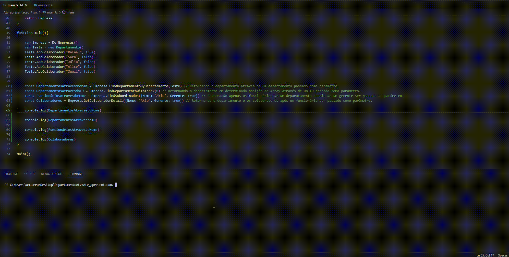

<h1 align = "center" > Atividade de Estrura de Dados - Gerenciamento de Empresa/Departamentos/Funcionários </h1>

## Dependências 

-`NODEJS v18`: <a href=https://nodejs.org/en</a>

## Descrição do projeto 

O projeto consiste em um gerenciamento com base em um grafo em estrutura de dados, onde em uma empresa pode ser alocado 5 departamentos e em cada departamentos 5 funcionários sendo um deles
um gerente.

## :hammer: Instruções de como usar

`NPM`: Ao entrar na pasta do projeto após a instalação do Node é necessário executar o commando 'npm install' no terminal.

`Execução`: Na mesma pasta do projeto agora com a etapa acima efetuada, pode ser executado através do comando 'npm start' no terminal assim como mostra o gif abaixo.

  
